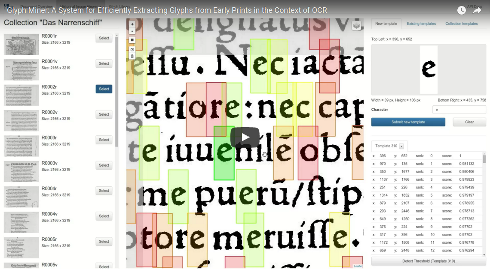

# The Glyph Miner software package
Glyph Miner is a software for rapidly extracting glyph occurrences from early
typeset prints.

**NOTE:** The software is currently in an early version that is meant for
testing. In particular, there are known problems when using **Firefox**. We
recommend using **Chrome/Chromium** when interacting with Glyph Miner.

## Background
While off-the-shelf OCR systems work well on many modern documents, they need to be
specifically "trained" to achive good results on particular early prints. Employing
efficient user interactions, Glyph Miner helps in this process by rapidly locating
sample occurrences of glyphs (which can be used for the training).

Glyph Miner and the algorithmic ideas behind it are currently being developed by
[Benedikt Budig](http://www1.informatik.uni-wuerzburg.de/en/staff/budig_benedikt/)
and [Thomas van Dijk](http://www1.informatik.uni-wuerzburg.de/en/staff/dijk_thomas_van/),
University of Würzburg. The project is supported by Würzburg University Library
and the [Kallimachos](http://kallimachos.de/) project.

## Run it with Docker
Glyph Miner comes with a Dockerfile for easy deployment and testing. Make sure
you have installed a recent version of [Docker](https://www.docker.com/). First,
check out the repository and build the Glyph Miner Docker image:

    git clone git@gitlab2.informatik.uni-wuerzburg.de:beb78iu/histmaps.git
    cd histmaps/docker
    docker build -t glyphminer .

You can run a new container based on this image using:

    docker run -p 8080:80 --name glyphminer -t -i glyphminer

Once the container has been spun up, the Glyph Miner interface is available at
`http://localhost:8080`.

**BEWARE**: In this default configuration, any changes
you make to the system (like adding documents, mining glyphs, etc.) are not
persistant and will be **lost** once the container is stopped.

## Manual Installation
The Glyph Miner software is preferably installed on a Linux machine. This guide
shows how to install the software on Ubuntu 14.04 LTS; for other distributions,
the process should be similar.

### Required Packages
First, make sure you have the following packages installed on your system:

`nginx mysql-server git python-numpy python-pil make g++ python-dev python-pip python-mysqldb`

### Setting up nginx and uWSGI
The python server (handling the image processing and the connection to the
database) will be accessible through an nginx web server (handling the static
content).

You will need a recent version of uwsgi. Get the newest version through PIP:
`sudo pip install uwsgi`

Let nginx know that calls to the API will be handled by the python server by
adding the following lines in /etc/nginx/sites-enabled/default:

    root    /home/budig/histmaps/web

    location /api/ {
        root /home/budig/histmaps/server;
        client_max_body_size 100M;

        include uwsgi_params;
        uwsgi_pass 127.0.0.1:9090;
        uwsgi_read_timeout 300;
    }

Do not forget to restart nginx in order to make your changes work:
`sudo service nginx restart`

### Installing Glyph Miner
To get the latest version of the software, clone our git repository:
`git clone -b synth --single-branch git@gitlab2.informatik.uni-wuerzburg.de:beb78iu/histmaps.git`

Next, you need to compile the C++ library that handles the template matching:

    cd histmaps/server
    make standalone

Last but not least, make sure the correct rights are set so that the server can
write into `web/tiles`, `web/thumbnails`, `web/synthetic_pages`, `server/images`
and `server/templates`.

### Setting up the database
Glyph Miner uses a MySQL database to store its data. Create a new database and
user `glyphminer` for Glyph Miner:

    mysql -u root -p
    mysql> create database glyphminer;
    mysql> grant usage on *.* to glyphminer@localhost identified by 'glyphminer';
    mysql> grant all privileges on glyphminer.* to glyphminer@localhost;

Import the database structure into the new database:

    mysql -u glyphminer -p glyphminer < server/schema.sql

You can configure the credentials that Glyph Miner will use in `server/server.py`,
line 48.

### Starting it up
You can start the python server using uwsgi using the following command:

`/usr/local/bin/uwsgi --socket 127.0.0.1:9090 --chdir /home/budig/histmaps/server/ --wsgi-file /home/budig/histmaps/server/server.py --master --processes 4 --threads 2`

## License
Copyright (C) 2016 Benedikt Budig

This program is free software: you can redistribute it and/or modify
it under the terms of the GNU General Public License as published by
the Free Software Foundation, either version 3 of the License, or
(at your option) any later version.

This program is distributed in the hope that it will be useful,
but WITHOUT ANY WARRANTY; without even the implied warranty of
MERCHANTABILITY or FITNESS FOR A PARTICULAR PURPOSE.  See the
GNU General Public License for more details.

You should have received a copy of the GNU General Public License
along with this program.  If not, see <http://www.gnu.org/licenses/>.

The LodePNG library used in this software is Copyright (C) 2005-2014 Lode
Vandevenne.
