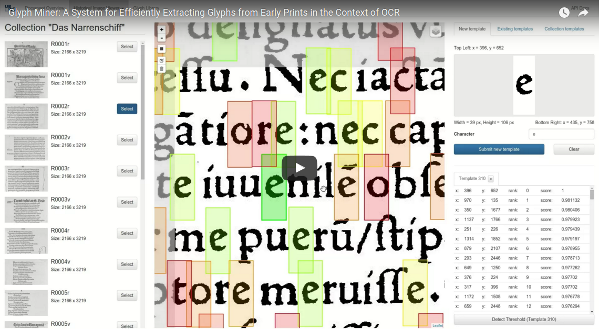

Glyph Miner
===========

Coming soon: Glyph Miner, a system for extracting glyphs from early typeset prints.

Background
----------
While off-the-shelf OCR systems work well on many modern documents, they need to be 
specifically "trained" to achive good results on particular early prints. Employing 
efficient user interactions, Glyph Miner helps in this process by rapidly locating 
sample occurrences of glyphs (which can be used for the training).

